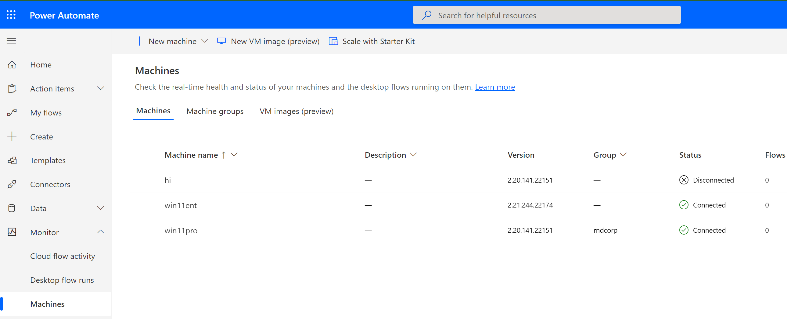

# How to set up your power-pwn cloud account

### Set up a malicious Microsoft tenant

1. Set up your free Microsoft tenant by following [Microsoft guidelines](https://docs.microsoft.com/en-us/azure/active-directory/verifiable-credentials/how-to-create-a-free-developer-account)
   
   

2. Create a malicious user account and assign it a _Power platform administrator_ role. The admin role isn't necessary, it's just convenient.

   

3. On a private browser tab

   1. Go to https://flow.microsoft.com and log in with the malicious user. Follow through the sign-in process to initiate a Power Automate trial license. 

   2. Follow the same process with https://make.powerapps.com to initiate a Power Apps trial license.

4. Create a Service Principal by following [Microsoft guidelines](https://docs.microsoft.com/en-us/power-automate/desktop-flows/machines-silent-registration#using-a-service-principal-account) and note the _tenantId_, _applicationId_ and _secret_. 

### Infect a test victim machines

1. Infect a test machine by following the [How to infect a victim machine guide](infect_machine.md).

2. Verify that the machine has been onboarded

   1. Log into https://flow.microsoft.com as the malicious user

   2. Click Go to _Monitor_ and then _Machines_ and verify that the test victim machine is there

   

### Upload pwntoso to your Power Automate cloud environment

1. Log into https://flow.microsoft.com with the malicious user.

2. Go to _Solutions_ and click _Import solution_

   

3. Zip the content of [pwntoso_1_0_0_1](../solution/pwntoso_1_0_0_1) and select it when asked to provide a solution file. Follow the guided process to completion.

   1. When asked to provide a connection, following the guided process to create a new machine connection. Use the test victim machine credentials. 

4. Go to _My flows_ and search for _Endpoint_

   

   Click on _Edit_ and then on _When a HTTP request is received_ and copy the URL under _HTTP POST URL_

   

5. Note the _HTTP Post URL_ for use with the Python module.